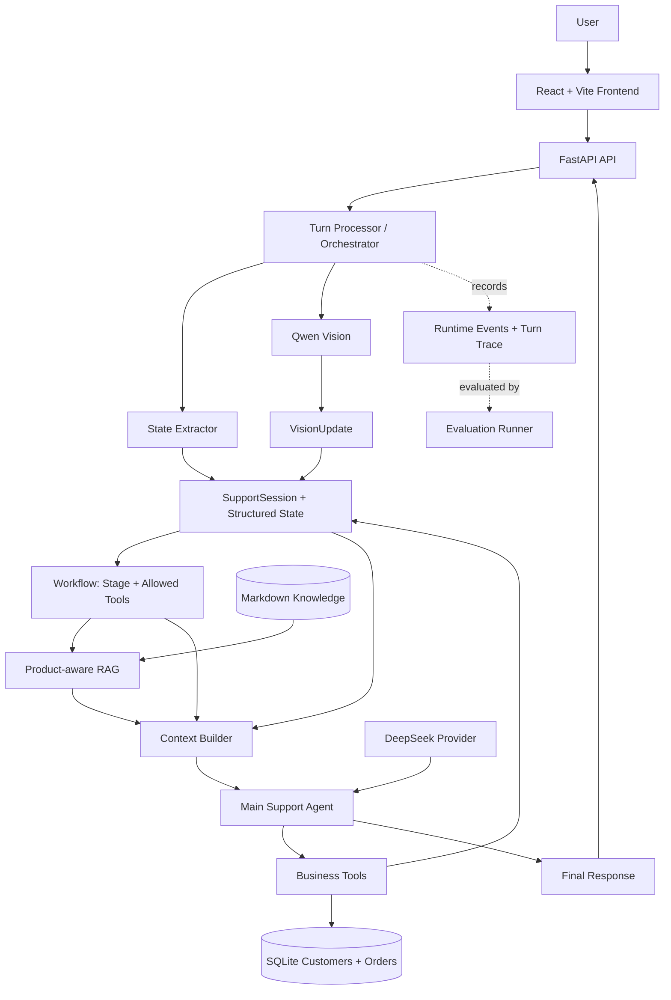

# SupportAgent

[English](README.md) · [简体中文](README.zh-CN.md)

## Quick Start

### 1. Clone the repository

```bash
git clone https://github.com/Sxxz223/SupportAgent.git
cd SupportAgent
```

### 2. Create and activate a virtual environment

```bash
python3 -m venv .venv
source .venv/bin/activate
```

### 3. Install backend dependencies

```bash
pip install -r requirements.txt
```

The embedding model is downloaded automatically on first use.

### 4. Configure API keys

```bash
cp .env.example .env
```

Edit `.env` in the repository root and add your provider credentials:

```dotenv
DEEPSEEK_API_KEY=
DASHSCOPE_API_KEY=
```

The backend automatically loads `.env` from the repository root. You do not need to export the variables or source the file manually. Existing shell environment variables take precedence over values in `.env`.

### 5. Start the backend

Run the following command from the repository root:

```bash
uvicorn api.app:app --reload
```

The API is available at `http://127.0.0.1:8000`, and Swagger UI is available at `http://127.0.0.1:8000/docs`.

### 6. Start the frontend

Open another terminal and run the following commands from the repository root:

```bash
cd frontend
npm install
npm run dev
```

Open `http://localhost:5173` for customer support chat, or visit `http://localhost:5173/admin` for the demo customer administration interface.

### 7. Run evaluations

Run all evaluation cases and generate a JSON report:

```bash
.venv/bin/python -m evaluation.cli --all --json evaluation_results.json
```

You can then open `http://127.0.0.1:8000/docs` and use the Evaluation endpoints to inspect the report.

---

## Project Overview

A product-aware multimodal customer support agent with deterministic workflow orchestration, identity verification, RAG, tool calling, persistent customer data, vision understanding, and evaluation tracing.

## Demo Preview

<!-- TODO: Add real screenshots after capturing the running application:
- docs/images/chat-demo.png
- docs/images/admin-demo.png
- docs/images/vision-demo.png
-->

The web application provides a customer chat workspace at `/` and a demo operations interface at `/admin`.

## Key Features

- **Stateful multi-turn conversations** — each in-memory `SupportSession` retains structured business facts, conversation history, runtime events, and bounded turn traces.
- **Deterministic workflow** — Python stage rules and tool permissions constrain what the Agent can do at each point in the support process.
- **Customer identity verification** — a stated name is not sufficient. A matching phone suffix or order number is required before purchase records, warranty data, or ownership tools become available.
- **Product-aware RAG** — semantic retrieval is restricted to the confirmed product namespace to prevent knowledge from different products from being mixed.
- **Multimodal perception** — Qwen Vision converts an uploaded image into a structured `VisionUpdate`; the workflow, rather than Vision, decides the business action.
- **Tool-to-State closure** — identity verification, ownership lookup, warranty lookup, and ticket creation update the same session State used by later decisions.
- **Persistent demo customer data** — customers, orders, purchase dates, and warranties are stored in SQLite. The database is created and seeded locally.
- **Evaluation and observability** — turn traces capture extraction, workflow snapshots, retrieval metadata, Vision observations, tool calls, state transitions, and final responses. Fixed evaluation cases can be run from the CLI and exported as JSON.
- **Web application** — FastAPI serves chat, multimodal, admin, and evaluation-report endpoints; React and Vite provide the chat and customer-admin interfaces.

## Architecture



The turn processor applies text and optional image perception before any workflow decision. A turn may contain several bounded Agent/tool steps, allowing identity verification to unlock an ownership lookup in the same HTTP request.

## Context Builder

The Context Builder is the bridge between program-owned facts and the model. It selects and labels the current State, Stage, allowed tools, retrieved knowledge, current or historical Vision evidence, important runtime events, and a bounded conversation excerpt. It produces one model-ready context without serializing the full Session, vectors, image bytes, SDK objects, or arbitrary internal data.

It is not a general-purpose memory system. `SupportState` remains the source of truth for business facts, while history and runtime telemetry remain separate.

## Why Not Just Use Prompts?

The application separates four responsibilities:

- **State** records what the system currently knows.
- **Workflow** decides which support stage applies.
- **Allowed Tools** define which business operations are executable now.
- **LLM** handles language understanding and decisions inside those constraints.

For example, a name alone leads to `verify_identity`, where only `verify_customer` is allowed. After a phone suffix or order number uniquely verifies the customer, the workflow enters `identify_product` and permits `get_owned_products`. These restrictions are enforced in Python and again inside the tools and services.

## Multimodal Data Flow

```text
Image → Qwen Vision → structured VisionUpdate → State merge
      → product-specific retrieval → Context Builder → Support Agent
```

Vision observations support unknown values. When an image does not establish a fact, the corresponding field remains `null`; the Vision provider does not directly choose the final support action. Current-turn observations are also distinguished from historical image facts.

## Product-aware RAG

Knowledge is organized by product namespace. The loader reads Markdown sections and metadata, `sentence-transformers/all-MiniLM-L6-v2` creates embeddings, cosine similarity ranks matching chunks, and the retriever returns the top results. Retrieval first resolves the current product and filters chunks to that product ID and namespace.

The current catalog contains:

- Anker Prime Charger (250W, 6 Ports, GaNPrime), model A2345
- Anker Nano Charger (70W, 3 Ports), model A121A
- soundcore Liberty 4 NC, model A3947

## Tools and Persistent Data

The Main Agent can receive these tools when permitted by the current workflow:

- `verify_customer` — verifies a stated name with a phone suffix or order number.
- `get_owned_products` — reads orders for the customer ID already verified in the current Session.
- `check_warranty` — reads warranty status for a verified customer's product.
- `create_ticket` — creates one idempotent demo repair ticket in the current Session.

SQLite stores demo customers and orders. Ticket persistence remains an in-process demo implementation. All customer records shipped as fixtures or seed data are synthetic demo data.

## Evaluation and Turn Tracing

Each successful or failed turn produces a bounded `TurnTrace`. Evaluation cases can check more than answer text:

```text
Extraction → State → Workflow → Retrieval → Vision → Tool → Answer
```

The runner isolates cases in separate Sessions, evaluates structured expectations, prints a terminal report, and can write a JSON report consumed by the read-only debug API. The repository currently has 125 passing backend regression tests; this is a test count, not a model-quality benchmark.

Run deterministic evaluation tests without external API calls:

```bash
.venv/bin/python -m unittest tests.test_evaluation_dataset tests.test_evaluation_runner -v
```

Run one live evaluation case when provider credentials are configured:

```bash
.venv/bin/python -m evaluation.cli --case case_01 --json evaluation_results.json
```

Live evaluation calls external model APIs and may incur provider cost.

## Project Structure

```text
agents/          Extractor and support Agent construction
api/             FastAPI transport, HTTP schemas, and in-memory Session store
application/     Session lifecycle, runtime events, and turn orchestration
context/         Controlled model-context construction
data/            Synthetic fixtures; local SQLite database is generated here
docs/            Screenshots and development notes
evaluation/      Fixed cases, evaluators, reports, runner, and CLI
frontend/        React + TypeScript + Vite chat and admin UI
knowledge/       Product-scoped Markdown support knowledge
products/        Canonical three-product catalog
providers/       DeepSeek and Qwen client configuration
rag/             Loading, embeddings, cosine similarity, and Top-K retrieval
repositories/    Customer/order and ticket persistence contracts
schemas/         Structured support and Vision state
services/        Deterministic customer, ownership, warranty, and ticket logic
tests/           Backend regression and evaluation tests
tools/           Agents SDK business-tool wrappers
trace/           Structured per-turn observability
vision/          Qwen and mock image perception
workflow/        Stage, action, State merge, and tool-permission rules
main.py          Multi-turn command-line demo
```

## API Overview

| Method | Path | Purpose |
|---|---|---|
| `GET` | `/health` | Service health check |
| `POST` | `/session` | Create an in-memory support Session |
| `POST` | `/chat` | Send a text turn |
| `POST` | `/chat/multimodal` | Send text and one PNG, JPEG, or WebP image |
| `GET/POST/PATCH/DELETE` | `/admin/...` | Demo customer and order operations |
| `GET` | `/debug/evaluation/latest` | Read the latest generated JSON report |
| `GET` | `/debug/evaluation/summary` | Read report aggregate fields |

See `/docs` for the generated OpenAPI documentation.

## Frontend

The frontend uses React, TypeScript, and Vite. It creates one backend Session per page lifetime and keeps display messages separate from backend business State. The chat supports Markdown responses, one-image upload, loading and error states, and a Gradient Waves background that transitions between idle and thinking states. Responses use ordinary non-streaming HTTP requests.

The `/admin` route is a demo operations interface for customer CRUD and order/product-ownership CRUD, including phone verification data, purchase dates, warranty dates, and order status. It is not a production administration system.

## Tests

```bash
# Backend
.venv/bin/python -m unittest discover -s tests -v

# Frontend
cd frontend
npm test
npm run build
```

Backend tests mock external model transport where needed. Passing offline tests does not establish live provider availability or model quality.

## Known Limitations

- Support Sessions are stored in memory and disappear when the API process restarts.
- SQLite and the admin interface are intended for local demonstration, without production authentication or RBAC.
- The API has no authentication, rate limiting, distributed locking, or production deployment configuration.
- Chat responses are non-streaming; there is no WebSocket transport or background task queue.
- Vision and language behavior depend on external Qwen and DeepSeek APIs.
- The local product catalog, knowledge base, and evaluation dataset are intentionally small.
- Tickets use a demo in-process repository rather than an external support system.
- Uploaded images are temporary files and are not retained.

## Future Work

- Persistent or distributed Session storage
- Production database, authentication, and RBAC
- Streaming responses and human handoff
- Retrieval reranking and a larger evaluation dataset
- Centralized production observability

## Data and Security Notes

- Never commit `.env` or provider credentials.
- The generated `data/support.db` is ignored; startup creates it and inserts synthetic seed data.
- Uploaded images are validated, size-limited, stored temporarily, and deleted after each request.
- Demo names, phone suffixes, and order numbers in source fixtures are synthetic and must not be reused as production identity data.

## Development Notes

Historical implementation reports are retained under [`docs/dev-notes/`](docs/dev-notes/) for reference. They describe incremental milestones and are not required to run the application.
