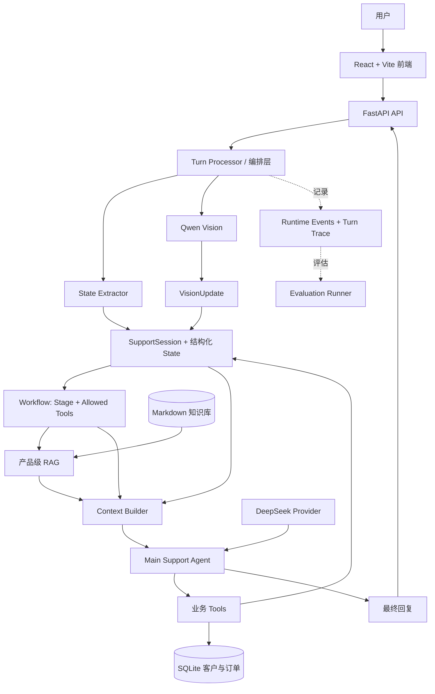

# SupportAgent

[English](README.md) · [简体中文](README.zh-CN.md)

## 项目简介

SupportAgent 是一个面向产品售后场景的多模态 AI 客服 Agent，支持确定性工作流编排、身份验证、产品级 RAG、工具调用、客户数据持久化、图片理解和评估追踪。

Web 应用在 `/` 提供客服聊天工作区，在 `/admin` 提供演示运营管理界面。

## 快速开始

### 1. 克隆项目

```bash
git clone https://github.com/Sxxz223/SupportAgent.git
cd SupportAgent
```

### 2. 创建并激活虚拟环境

```bash
python3 -m venv .venv
source .venv/bin/activate
```

### 3. 安装后端依赖

```bash
pip install -r requirements.txt
```

首次运行时会自动下载 embedding 模型。

### 4. 配置 API Key

```bash
cp .env.example .env
```

编辑项目根目录的 `.env`：

```dotenv
DEEPSEEK_API_KEY=
DASHSCOPE_API_KEY=
```

后端会自动加载项目根目录的 `.env`，无需手动执行 `export` 或 `source`。已存在的 Shell 环境变量优先于 `.env` 中的值。

### 5. 启动后端

```bash
uvicorn api.app:app --reload
```

API 地址为 `http://127.0.0.1:8000`，Swagger UI 地址为 `http://127.0.0.1:8000/docs`。

### 6. 启动前端

```bash
cd frontend
npm install
npm run dev
```

打开 `http://localhost:5173` 使用客服聊天，或访问 `http://localhost:5173/admin` 使用演示客户管理界面。

### 7. 运行 Evaluation

```bash
.venv/bin/python -m evaluation.cli --all --json evaluation_results.json
```

随后可在 `http://127.0.0.1:8000/docs` 中通过 Evaluation 相关接口查看报告。

## 核心能力

- **有状态的多轮对话**：每个内存中的 `SupportSession` 保存结构化业务事实、对话历史、运行时事件和有限长度的 Turn Trace。
- **确定性工作流**：Python 阶段规则和工具权限限制 Agent 在每个客服阶段可以执行的操作。
- **客户身份验证**：用户仅提供姓名不足以完成验证；必须同时匹配手机号后四位或订单号，才能查询购买记录、保修信息和产品归属。
- **产品级 RAG**：语义检索限定在已确认产品的知识空间内，避免不同产品的知识混用。
- **多模态感知**：Qwen Vision 将上传图片转为结构化 `VisionUpdate`，最终业务动作仍由工作流决定。
- **Tool-to-State 闭环**：身份验证、产品归属、保修查询和工单创建结果会更新同一个 Session State，并影响后续决策。
- **持久化演示数据**：客户、订单、购买日期和保修信息存储在 SQLite 中，数据库在本地创建并填充演示数据。
- **评估与可观测性**：Turn Trace 记录提取结果、工作流快照、检索元数据、视觉观察、工具调用、状态变化和最终回复。
- **Web 应用**：FastAPI 提供聊天、多模态、管理和评估报告接口；React + Vite 提供聊天与客户管理界面。

## 架构



Turn Processor 会先完成文本和可选图片的感知，再执行任何工作流决策。一次交互可以包含多个受限的 Agent/Tool 步骤，因此身份验证成功后，可以在同一个 HTTP 请求中继续解锁产品归属查询。

## Context Builder

Context Builder 负责连接程序持有的事实与模型。它会选择并标记当前 State、Stage、允许的工具、检索知识、本轮或历史视觉证据、重要运行事件，以及有限长度的对话摘录，然后生成一份模型可用的上下文。

它不会序列化完整 Session、向量、图片二进制、SDK 对象或任意内部数据。`SupportState` 始终是业务事实的来源，对话历史和运行遥测单独保存。

## 为什么不只依赖 Prompt

系统将职责分为四部分：

- **State**：记录系统当前已知的事实。
- **Workflow**：决定当前客服阶段。
- **Allowed Tools**：定义当前可以执行的业务操作。
- **LLM**：在约束内处理自然语言理解与决策。

例如，只有姓名时会进入 `verify_identity`，此时仅允许 `verify_customer`。手机号后四位或订单号完成唯一身份验证后，工作流进入 `identify_product`，并允许 `get_owned_products`。这些限制由 Python 和工具、服务层共同执行。

## 多模态数据流

```text
图片 → Qwen Vision → 结构化 VisionUpdate → State 合并
     → 产品级检索 → Context Builder → Support Agent
```

视觉字段支持未知值。图片无法确认某项事实时，对应字段保持 `null`；Vision Provider 不直接选择最终业务动作。本轮视觉观察也会与历史图片事实明确区分。

## 产品级 RAG

知识库按产品命名空间组织。Loader 读取 Markdown 章节和元数据，`sentence-transformers/all-MiniLM-L6-v2` 生成 embedding，余弦相似度对匹配内容排序，Retriever 返回 Top-K 结果。检索前会解析当前产品，并按产品 ID 和命名空间过滤知识块。

当前产品目录包括：

- Anker Prime Charger（250W、6 Ports、GaNPrime），型号 A2345
- Anker Nano Charger（70W、3 Ports），型号 A121A
- soundcore Liberty 4 NC，型号 A3947

## 工具与持久化数据

在当前工作流允许时，Main Agent 可以使用：

- `verify_customer`：使用手机号后四位或订单号验证指定姓名。
- `get_owned_products`：读取当前 Session 中已验证客户 ID 对应的订单。
- `check_warranty`：查询已验证客户产品的保修状态。
- `create_ticket`：在当前 Session 中以幂等方式创建一张演示维修工单。

SQLite 保存演示客户与订单。工单仍采用进程内演示实现。仓库中的 fixture 和 seed 数据均为合成演示数据。

## Evaluation 与 Turn Trace

每个成功或失败的交互都会生成有限长度的 `TurnTrace`：

```text
Extraction → State → Workflow → Retrieval → Vision → Tool → Answer
```

Runner 使用独立 Session 运行各个用例，检查结构化预期，输出终端报告，并可生成供只读调试 API 使用的 JSON 报告。

运行无需外部 API 的确定性评估测试：

```bash
.venv/bin/python -m unittest tests.test_evaluation_dataset tests.test_evaluation_runner -v
```

配置 Provider 凭据后，可运行单个实时评估用例：

```bash
.venv/bin/python -m evaluation.cli --case case_01 --json evaluation_results.json
```

实时评估会调用外部模型 API，可能产生费用。

## 项目结构

```text
agents/          Extractor 与 Support Agent 组装
api/             FastAPI 传输层、HTTP Schema 与内存 Session Store
application/     Session 生命周期、Runtime Events 与交互编排
context/         受控的模型 Context 构建
data/            合成 fixture；本地 SQLite 数据库在此生成
docs/            截图与开发记录
evaluation/      固定用例、Evaluator、报告、Runner 与 CLI
frontend/        React + TypeScript + Vite 聊天与管理 UI
knowledge/       按产品划分的 Markdown 客服知识
products/        三类产品的规范目录
providers/       DeepSeek 与 Qwen Client 配置
rag/             加载、Embedding、余弦相似度与 Top-K 检索
repositories/    客户、订单与工单持久化接口
schemas/         结构化 Support 与 Vision State
services/        确定性客户、归属、保修与工单逻辑
tests/           后端回归与评估测试
tools/           Agents SDK 业务工具 Wrapper
trace/           每轮结构化可观测数据
vision/          Qwen 与 Mock 图片感知
workflow/        Stage、Action、State 合并与工具权限规则
main.py          多轮命令行演示
```

## API 概览

| 方法 | 路径 | 用途 |
|---|---|---|
| `GET` | `/health` | 服务健康检查 |
| `POST` | `/session` | 创建内存 Support Session |
| `POST` | `/chat` | 发送纯文本交互 |
| `POST` | `/chat/multimodal` | 发送文本和一张 PNG、JPEG 或 WebP 图片 |
| `GET/POST/PATCH/DELETE` | `/admin/...` | 演示客户与订单管理 |
| `GET` | `/debug/evaluation/latest` | 读取最新生成的 JSON 报告 |
| `GET` | `/debug/evaluation/summary` | 读取报告汇总字段 |

完整 OpenAPI 文档见 `/docs`。

## 前端

前端使用 React、TypeScript 和 Vite。每次页面生命周期创建一个后端 Session，UI 消息与后端业务 State 分开管理。聊天支持 Markdown 回复、单图片上传、加载和错误状态，以及在 idle/thinking 状态间平滑变化的 Gradient Waves 背景。响应使用普通非流式 HTTP 请求。

`/admin` 是用于客户 CRUD 和订单/产品归属 CRUD 的演示运营界面，包含电话验证数据、购买日期、保修日期和订单状态。它不是生产管理系统。

## 测试

```bash
# 后端
.venv/bin/python -m unittest discover -s tests -v

# 前端
cd frontend
npm test
npm run build
```

必要时后端测试会 Mock 外部模型传输。离线测试通过不代表外部 Provider 可用或模型质量达到生产要求。

## 已知限制

- Support Session 存储在内存中，API 进程重启后会丢失。
- SQLite 和管理界面仅用于本地演示，没有生产级身份验证或 RBAC。
- API 尚无身份验证、限流、分布式锁和生产部署配置。
- 聊天响应为非流式，不含 WebSocket 或后台任务队列。
- 视觉与语言能力依赖外部 Qwen 和 DeepSeek API。
- 本地产品目录、知识库和评估数据集规模有限。
- 工单使用进程内演示 Repository，而非外部客服系统。
- 上传图片使用临时文件，不会长期保留。

## 后续方向

- 持久化或分布式 Session Storage
- 生产数据库、身份验证与 RBAC
- 流式响应与人工接管
- Retrieval Reranking 与更大的评估数据集
- 集中式生产可观测性

## 数据与安全说明

- 不要提交 `.env` 或 Provider 凭据。
- 生成的 `data/support.db` 已被忽略；启动时会创建数据库并插入合成 Seed 数据。
- 上传图片会经过类型和大小校验，临时保存，并在每次请求结束后删除。
- 源码 fixture 中的演示姓名、手机号后四位和订单号均为合成数据，不应作为生产身份数据使用。

## 开发记录

历史实现报告保存在 [`docs/dev-notes/`](docs/dev-notes/) 中，仅供参考，运行应用不依赖这些文件。
